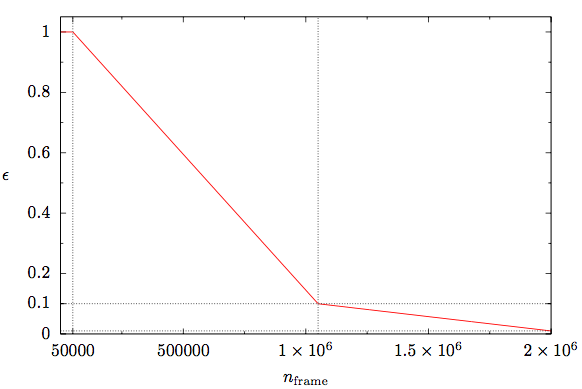

## DQN

代码参考了http://slazebni.cs.illinois.edu/fall18/assignment5.html中提供的初始代码

模型定义如下,除了基础的`DQN`外，还实现了`Dueling_DQN`

```python
import torch
import torch.nn as nn
import torch.nn.functional as F

class DQN(nn.Module):
    def __init__(self, action_size):
        super(DQN, self).__init__()
        self.conv1 = nn.Conv2d(4, 32, kernel_size=8, stride=4)
        self.conv2 = nn.Conv2d(32, 64, kernel_size=4, stride=2)
        self.conv3 = nn.Conv2d(64, 64, kernel_size=3, stride=1)
        self.fc = nn.Linear(3136, 512)
        self.head = nn.Linear(512, action_size)

        for m in self.modules():
            if isinstance(m, nn.Conv2d) or isinstance(m, nn.Linear):
                nn.init.kaiming_normal_(m.weight, mode='fan_out', nonlinearity='relu')

    def forward(self, x):
        x = F.relu(self.conv1(x))
        x = F.relu(self.conv2(x))
        x = F.relu(self.conv3(x))
        x = F.relu(self.fc(x.view(x.size(0), -1)))
        return self.head(x)

class Dueling_DQN(nn.Module):
    def __init__(self, action_size):
        super(Dueling_DQN, self).__init__()
        self.action_size = action_size

        self.conv1 = nn.Conv2d(4, 32, kernel_size=8, stride=4)
        self.conv2 = nn.Conv2d(32, 64, kernel_size=4, stride=2)
        self.conv3 = nn.Conv2d(64, 64, kernel_size=3, stride=1)
        self.fc1_adv = nn.Linear(3136, 512)
        self.fc1_val = nn.Linear(3136, 512)
        self.fc2_adv = nn.Linear(512, action_size)
        self.fc2_val = nn.Linear(512, 1)

        for m in self.modules():
            if isinstance(m, nn.Conv2d) or isinstance(m, nn.Linear):
                nn.init.kaiming_normal_(m.weight, mode='fan_out', nonlinearity='relu')

    def forward(self, x):
        x = F.relu(self.conv1(x))
        x = F.relu(self.conv2(x))
        x = F.relu(self.conv3(x))
        x = x.view(x.size(0), -1)
        
        adv = F.relu(self.fc1_adv(x))
        val = F.relu(self.fc1_val(x))

        adv = self.fc2_adv(adv)
        val = self.fc2_val(val).expand(x.size(0), self.action_size)

        x = val + adv - adv.mean(1).unsqueeze(1).expand(x.size(0), self.action_size)

        return x
```

## Exploration-exploitation trade-off

按照下图对选取随机动作的概率进行递减

 

每次调用`train_policy_net`时会对`epsilon`进行更新，前50000帧不进行训练

 ```python
self.epsilon = 1.0  
self.epsilon_middle = 0.1
self.epsilon_min = 0.01
self.explore_step = 1000000 / 4
self.epsilon_first_decay = (self.epsilon - self.epsilon_middle) / self.explore_step
self.epsilon_last_decay = (self.epsilon_middle - self.epsilon_min) / self.explore_step
if self.epsilon > self.epsilon_middle:
    self.epsilon -= self.epsilon_first_decay
elif self.epsilon > self.epsilon_min:
    self.epsilon -= self.epsilon_last_decay
 ```

## DDQN

代码如下

```python
# Compute Q(s_t, a) - Q of the current state
state_q = self.policy_net(states).gather(1, actions.unsqueeze(1)).squeeze(1)

# ddqn
if self.use_ddqn:
    # Compute Q function of next state
    next_state_q = self.policy_net(next_states)
    _, arg_q = next_state_q.data.cpu().max(1)
    arg_q = arg_q.to(device)

    double_q = self.target_net(next_states).gather(1, arg_q.unsqueeze(1)).squeeze(1)

    expected_q = rewards + double_q * self.discount_factor * (1 - dones)
# dqn
else:
    # Compute Q function of next state
    next_state_q = self.target_net(next_states).detach().max(1)[0]

    # Find maximum Q-value of action at next state from target net
    expected_q = rewards + double_q * self.discount_factor * (1 - dones)
```

## 超参


```
# Hyperparameters for DQN agent, memory and training
EPISODES = 500000
HEIGHT = 84
WIDTH = 84
HISTORY_SIZE = 4
learning_rate = 0.0001
evaluation_reward_length = 100
Memory_capacity = 1000000
render_breakout = True
batch_size = 32
Update_policy_network_frequency = 4
Update_target_network_frequency = 10000
train_frame = 50000
```


