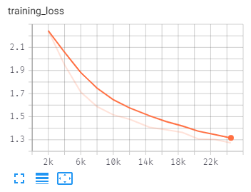
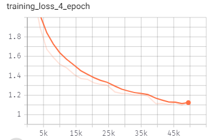

## cifar10_origin

代码见`cifar10_origin.ipynb`

使用原始代码运行，loss变化如图



准确率如下

```
Accuracy of the network on the 10000 test images: 53 %
Accuracy of plane : 33 %
Accuracy of   car : 79 %
Accuracy of  bird : 32 %
Accuracy of   cat : 59 %
Accuracy of  deer : 56 %
Accuracy of   dog : 27 %
Accuracy of  frog : 63 %
Accuracy of horse : 54 %
Accuracy of  ship : 80 %
Accuracy of truck : 51 %
```

将训练的epoch翻倍，loss基本稳定在1.1，训练所得的loss曲线和准确率如下



```
Accuracy of the network on the 50000 train images: 61 %
Accuracy of the network on the 10000 test images: 57 %
Accuracy of plane : 55 %
Accuracy of   car : 76 %
Accuracy of  bird : 52 %
Accuracy of   cat : 32 %
Accuracy of  deer : 65 %
Accuracy of   dog : 52 %
Accuracy of  frog : 52 %
Accuracy of horse : 67 %
Accuracy of  ship : 81 %
Accuracy of truck : 39 %
```

第一层卷积之后的特征图如下


第二层卷积之后的特征图如下


## Resnet9

代码见`cifar10_resnet9.ipynb`

网络结构如下

```
ResNet(
  (conv1): Conv2d(3, 64, kernel_size=(3, 3), stride=(1, 1), padding=(1, 1), bias=False)
  (bn1): BatchNorm2d(64, eps=1e-05, momentum=0.1, affine=True, track_running_stats=True)
  (relu): ReLU(inplace=True)
  (maxpool): MaxPool2d(kernel_size=3, stride=2, padding=1, dilation=1, ceil_mode=False)
  (layer1): Sequential(
    (0): BasicBlock(
      (conv1): Conv2d(64, 64, kernel_size=(3, 3), stride=(1, 1), padding=(1, 1), bias=False)
      (bn1): BatchNorm2d(64, eps=1e-05, momentum=0.1, affine=True, track_running_stats=True)
      (relu): ReLU(inplace=True)
      (conv2): Conv2d(64, 64, kernel_size=(3, 3), stride=(1, 1), padding=(1, 1), bias=False)
      (bn2): BatchNorm2d(64, eps=1e-05, momentum=0.1, affine=True, track_running_stats=True)
    )
  )
  (layer2): Sequential(
    (0): BasicBlock(
      (conv1): Conv2d(64, 128, kernel_size=(3, 3), stride=(2, 2), padding=(1, 1), bias=False)
      (bn1): BatchNorm2d(128, eps=1e-05, momentum=0.1, affine=True, track_running_stats=True)
      (relu): ReLU(inplace=True)
      (conv2): Conv2d(128, 128, kernel_size=(3, 3), stride=(1, 1), padding=(1, 1), bias=False)
      (bn2): BatchNorm2d(128, eps=1e-05, momentum=0.1, affine=True, track_running_stats=True)
      (downsample): Sequential(
        (0): Conv2d(64, 128, kernel_size=(1, 1), stride=(2, 2), bias=False)
        (1): BatchNorm2d(128, eps=1e-05, momentum=0.1, affine=True, track_running_stats=True)
      )
    )
  )
  (layer3): Sequential(
    (0): BasicBlock(
      (conv1): Conv2d(128, 256, kernel_size=(3, 3), stride=(2, 2), padding=(1, 1), bias=False)
      (bn1): BatchNorm2d(256, eps=1e-05, momentum=0.1, affine=True, track_running_stats=True)
      (relu): ReLU(inplace=True)
      (conv2): Conv2d(256, 256, kernel_size=(3, 3), stride=(1, 1), padding=(1, 1), bias=False)
      (bn2): BatchNorm2d(256, eps=1e-05, momentum=0.1, affine=True, track_running_stats=True)
      (downsample): Sequential(
        (0): Conv2d(128, 256, kernel_size=(1, 1), stride=(2, 2), bias=False)
        (1): BatchNorm2d(256, eps=1e-05, momentum=0.1, affine=True, track_running_stats=True)
      )
    )
  )
  (layer4): Sequential(
    (0): BasicBlock(
      (conv1): Conv2d(256, 512, kernel_size=(3, 3), stride=(2, 2), padding=(1, 1), bias=False)
      (bn1): BatchNorm2d(512, eps=1e-05, momentum=0.1, affine=True, track_running_stats=True)
      (relu): ReLU(inplace=True)
      (conv2): Conv2d(512, 512, kernel_size=(3, 3), stride=(1, 1), padding=(1, 1), bias=False)
      (bn2): BatchNorm2d(512, eps=1e-05, momentum=0.1, affine=True, track_running_stats=True)
      (downsample): Sequential(
        (0): Conv2d(256, 512, kernel_size=(1, 1), stride=(2, 2), bias=False)
        (1): BatchNorm2d(512, eps=1e-05, momentum=0.1, affine=True, track_running_stats=True)
      )
    )
  )
  (avgpool): AdaptiveAvgPool2d(output_size=(1, 1))
  (fc): Linear(in_features=512, out_features=10, bias=True)
)
```

由于用到了BN层，将`batch_size`调大为64，优化器选用SGD+Momentum，使用余弦退火的方式设定学习率，得到的准确率如下，此时模型已经出现了过拟合的情况

```
Accuracy of the network on the 50000 train images: 99 %
Accuracy of the network on the 10000 test images: 82 %
Accuracy of plane : 87 %
Accuracy of   car : 88 %
Accuracy of  bird : 77 %
Accuracy of   cat : 61 %
Accuracy of  deer : 83 %
Accuracy of   dog : 79 %
Accuracy of  frog : 91 %
Accuracy of horse : 85 %
Accuracy of  ship : 94 %
Accuracy of truck : 85 %
```

在数据预处理时随机翻转图像后再传入网络可将测试集准确率提升至87%，但过拟合状况依旧比较严重，在数据预处理中加入随机裁剪（加了Pading保持图像大小不变），同时提高训练次数到40次，可将网络的准确率提高到90%

```
Accuracy of the network on the 50000 train images: 96 %
Accuracy of the network on the 10000 test images: 90 %
Accuracy of plane : 89 %
Accuracy of   car : 96 %
Accuracy of  bird : 83 %
Accuracy of   cat : 86 %
Accuracy of  deer : 90 %
Accuracy of   dog : 81 %
Accuracy of  frog : 87 %
Accuracy of horse : 93 %
Accuracy of  ship : 96 %
Accuracy of truck : 94 %
```

