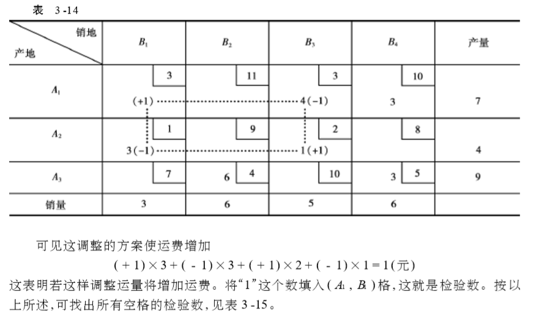
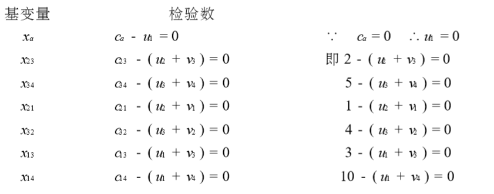
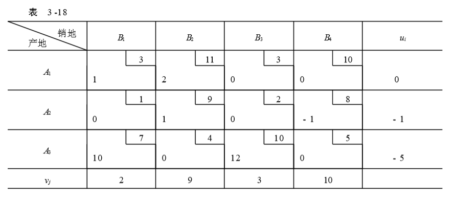
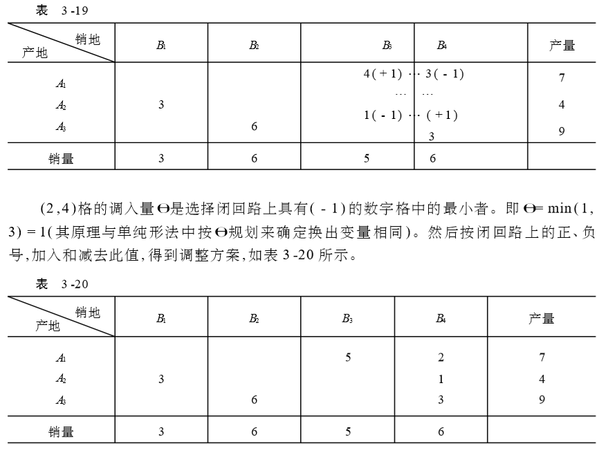
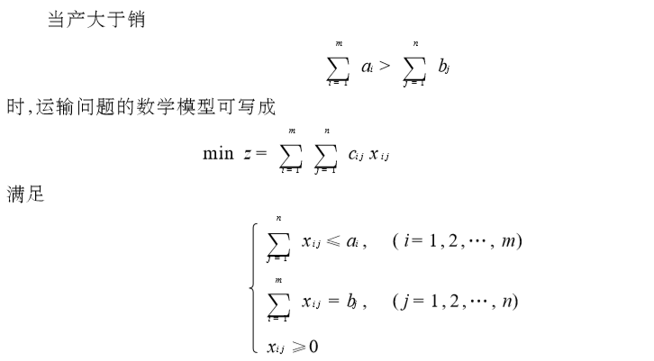

# 运输问题

## 数学模型

两个表：

- 单位运价表
- 产销平衡表

## 表上作业法

### 确定初始基可行解

#### 最小元素法

从单位运价表中选最小的运价开始确定供销关系，然后次小，一直到给出初始基可行解

#### 伏格尔法

最小元素法的缺点是:为了节省一处的费用, 有时造成在其他处要多花几倍的运费。 

伏格尔法考虑到,一产地的产品假如不能按最小运费就近供应,就考虑次小运费, 这就有一个差额。差额越大,说明不能按最小运费调运时, 运费增加越多。因而对差额最大处, 就应当采用最小运费调运。

- 求出各行和各列的最小运费和次最小运费的差距

- 从行或列差额中选最大，选择它所在行或列中的最小元素，优先供应

**每次划去时要更新行列差**

### 最优解的判别

#### 闭回路法

以每一空格找一条闭回路，以某空格为起点，水平或垂直前进，遇到数字格可以转90°，直到回到初始空格

当检验数还存在负数，说明原方案不是最优解

#### 位势法

对于每一个基变量，其校验数的计算方法

计算步骤：

- 确定初始解

- 在基变量位置填入单位运价

- 列中填入u，行中填入v

- 按$\sigma_{ij}=c_{ij}-(u_i+v_j)$，计算所有空格的检验数

若表中还有负检验数，说明未得最优解

### 改进的方法——闭回路调整法

选择最小的负检验数，以它对应的空格为调入格，即以它对应的非基变量为换入变量，以其为起点，作一闭回路

调入量的选择为对应格上行列的最小值

在调整后重新用闭回路法或位势法，计算是否最优解

### 表上作业法计算的问题

#### 无穷多最优解

当某个非基变量的检验数为0时，该问题有无穷多最优解

#### 退化

需要在格上填0，表示此格为数字格

- 在确定初始解时，由于同时消去了行和列，为了保证表上有(m+n-1)个数字格，在对应行列上任选一格加一个0

- 在用闭回法调整时，闭回路上同时出现两个具有-1标记的相等的最小值，只能选择一个作为调入格，此时另一个数字格必须填入0

## 产销不平衡的运输问题及其求解方法

- **产大于销**

产大于销，所以需要将多余的物资储存在某一产地（相当于虚拟销地），可以设$x_{i,n+1}$为储存量，去配平方程式

具体求解时在右边多加一列，其单位运价为0

- **销大于产**

虚拟一个产地$A_{m+1}$

具体计算时在下方加一行，其单位运价为0