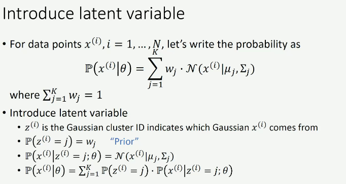
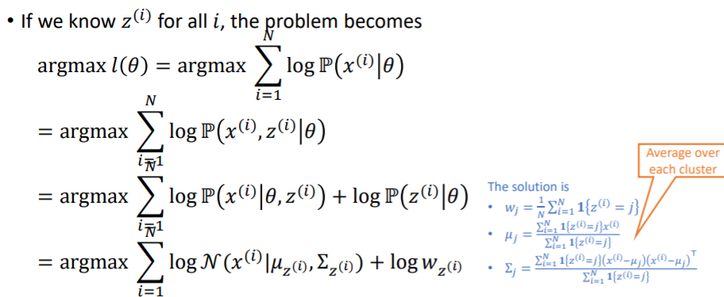
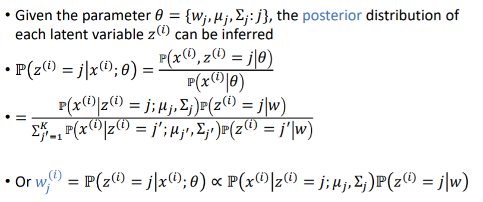
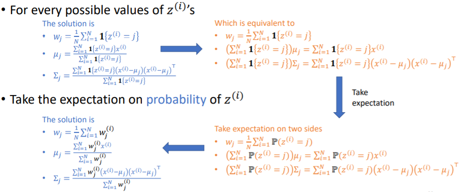

## 高斯混合模型（gmm）

对于单维变量，给定均值$\mu$和方差$\sigma$，高斯分布的概率密度函数为
$$
f\left(x | \mu, \sigma^{2}\right)=\frac{1}{\sqrt{2 \pi \sigma^{2}}} e^{-\frac{(x-\mu)^{2}}{2 \sigma^{2}}}
$$
对于多维变量，$\mu$为均值，$\Sigma$为协方差，$d$为维数
$$
\mathcal{N}(x | \mu, \Sigma)=\frac{\exp \left(-\frac{1}{2}(x-\mu)^{\top} \Sigma^{-1}(x-\mu)\right)}{\sqrt{(2 \pi)^{d}|\Sigma|}}
$$
高斯混合模型就是k个单一高斯模型的加权求和，即，其中$w_j$为权重，权重之和为1
$$
p(x)=\sum_{j=1}^{K}w_{j} \cdot \mathcal{N}\left(x | \mu_{j}, \Sigma_{j}\right)
$$

### Data generation

给定一个高斯混合模型，可以按照如下步骤生成数据

1. 根据先验分布（$w_j$）选择高斯混合成分j
2. 根据高斯混合成分j的概率密度函数进行采样

### 训练过程

利用MLE找出$\theta$最大化概率函数$P(x|\theta)$
$$
\theta^{*}=\arg \max _{\theta} P(X | \theta)=\arg \max _{\theta} \prod_{i=1}^{N} p\left(x_{i} | \theta\right)
$$

- $z^{(i)}$为样本$x^{(i)}$由第j个成分生成
- $w_j$为先验概率
- $P(x^{(i)}|z^{(i)}=j;\theta)$为条件概率
- $P(x^{(i)}|\theta)$为全概率

最大化以下似然函数
$$
l(\theta)=\sum_{i=1}^{N} \log \mathbb{P}\left(x^{(i)} ; \theta\right)=\sum_{i=1}^{N} \log \sum_{j} \mathbb{P}\left(x^{(i)}, z^{(i)}=j ; \theta\right)
$$
即
$$
\begin{array}{l}
\operatorname{argmax} l(\theta)=\operatorname{argmax} \sum_{i=1}^{N} \log \sum_{j=1}^{K} \mathbb{P}\left(z^{(i)}=j\right) \cdot \mathbb{P}\left(x^{(i)} | z^{(i)}=j ; \theta\right) \\
=\operatorname{argmax} \sum_{i=1}^{N} \log \sum_{j=1}^{K} w_{j} \cdot \mathcal{N}\left(x^{(i)} | \mu_{j}, \Sigma_{j}\right)
\end{array}
$$

计算后验概率

