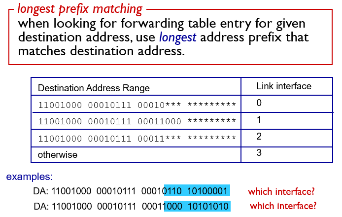
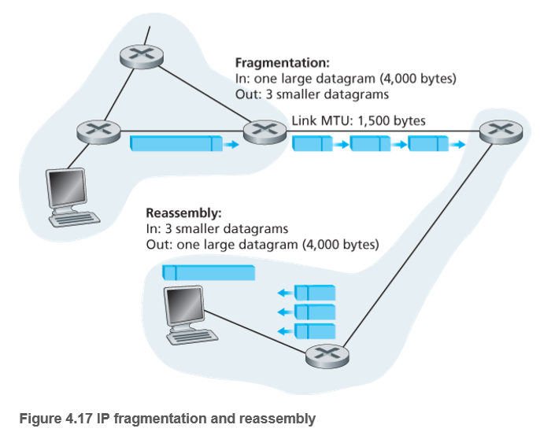
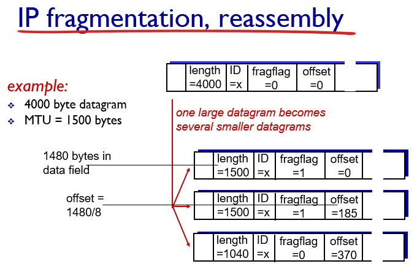

# Network Layer:The Data Plane

## Overview

**two important network-layer functions**：

- Forwarding
- Routing

## What's inside a router

### Router Architecture 

#### Input Ports

- 作为接入Rounter的实体
- 完成查询和转发的功能

#### Switching Fabric

三种类型

#### Output Ports

- 将重新封装的包发出

#### Routing processor

- 控制流量

### Virtual-Circuit Networks

交换机维护路由器之间连接的虚电路

### Destination-based forwarding  

终端封包时标记目的终端的地址，Router维持一个表用于查询对应的目的终端地址应该转发到哪里

当有多个符合，采用最长前置码相符的原则

## IP

### IPv4 datagram

### IPv4 Datagram Fragmentation & Reassembly

MTU(maximum transmission unit)：物理层中能传输的最大数据大小

数据包被发送时会被分片，高MTU链路到低MTU链路，数据包会继续进行分包（对碎片进行分包而不是重新分包），低MTU到高MTU则不做处理

**分片例子**，每个碎片有20bytes的报头，每个报头记录偏移的字节数

###  IPv4 Addressing

IP地址与子网掩码

### DHCP

1. 课上ppt讲过的内容
2. 第四、六、七章很重要，其中第六章占50%