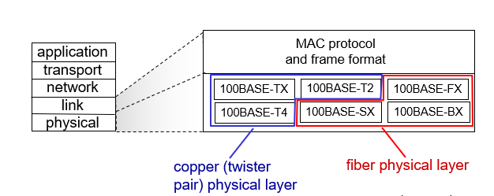

# The Link Layer and LANs

链路之间的协议，可靠程度不同，Link Layer负责两个结点之间的连接

## Introduction

`Link`之间的协议，可靠程度不同，`Link Layer`负责两个`node`之间的通信

`Link Layer`封装数据包为帧（Frame），并增加错误检测，流量控制等的信息

- nodes：hosts and roouters
- links
  - wired
  - wireless
  - LANs
- frame：encapsulates datagram

### Llnk Layer Services

- framinng, link access
- reliable delivery between adjacent nodes
- flow control
- error deection
- error correction
- half-duplex and full-duplex

## Error-Detection and Correction Techniques

**EDC** = **E**rror **D**etection and **C**orrection bits

**D** = Data(may include header)

### Parity checking

奇偶校验

1比特校验只能检测错误

通过增加奇偶校验位的维度可检测并修正单个bit errors

### Cyclic Redundancy Check

循环冗余校验

- 选定一个`r+l`bit 的除数

- 模2运算相当于异或运算
- 接收方将<D,R>数据除以G，若最后结果为0，则数据没有差错

## Multiple access protocols

### Ideal Multiple access protocols

- 只有一个节点活跃时，该节点具有R的吞吐量
- 当有M的节点时，每个活跃节点的吞吐量接近R/M
- 去中心化

### MAC protocols

#### Channel Paritioning（信道划分）

- TDMA：划分时间
  - 每个结点获	得固定长度的使用时间

- FDMA：划分频率
  - 每个节点获得某个频率

#### Radom Access（随机接入）

##### Slotted ALOHA

- 没有碰撞：按满速传输
- 检测到碰撞：已某个概率在下一时间段重新传输直至传输成功

##### CSMA（Carrier Sense Multiple Access）

载波侦听多路访问

传输前检测链路状况，链路空闲时才发送

但由于延迟的存在，碰撞仍然有可能发生

###### CSMA/CD（Collision Dection）

如果在发送过程中检测到碰撞

- 发送阻塞信息并停止发送数据
- 在固定时间内等待随机的时间再次发送

#### Taking Turns（轮流接入）

##### Polling protocol（轮询）

选定一个作为主节点，主节点轮询每个节点，告知每个节点能传输的帧的最多数量

##### Token-passing protocol（令牌传递）

只有拥有令牌的才能进行传输，令牌以固定的次序在节点间交换

##### DOCSIS

使用CMTS管理网络，下行使用FDM，上行使用TDM，下行的数据被所有调制解调器收到，上行通道由CMTS控制，调制解调器在特定的时隙中传输

## Switched Local Area Networks

### Link-Layer Addressing and ARP

#### MAC Addresses

- 12位十六进制数
- 每个适配器的MAC唯一
- 前6位为厂商号
- 广播地址为`FF-FF-FF-FF-FF-FF`

#### Address Resolution Protocol (ARP) 

- 将IP解析为MAC
- ARP只为局域网中的设备服务
- 主机或路由器维护一个ARP表，包含IP和MAC的映射关系，以及TTL，如果某一行没有使用，会被删除
- 当ARP表不包含需要的信息时，主机发送ARP查询包，使用广播的方法询问子网中的其他设备，并更新自己的ARP表

### Ethnet

- 以太网之间的传输采用无连接，不可靠服务
- 传输协议采用CSMA/CD
- 以太网的物理层协议不同，T开头一般为双绞铜线

### Link-Layer Switches

- Forwarding and Filtering：过滤和转发，依赖交换机表完成，表中没有则广播，有且非回路则进行转发，有且为回路则丢弃
- Self-Learning：表会根据数据包自动更新交换机表，记录MAC地址及相应的接口，并记录TTL