# Wireless and Mobile Networks

##  Wireless Links and Network Characteristics

无线的特点

- decreased signal strength信号衰减
- interference from other sources共享信道
- multipath propagation多径传播

**Signal-to-Noise Ratin(SNR)**用于衡量信号的强弱，单位为dB

**Bit Error Rate(BER)**，SNR越高，BER越小，BER也与信号调制方式有关

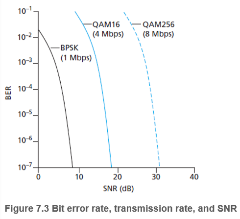

- **Hidden terminal problem**

由于环境遮挡或者信号的衰减导致设备AC之间不能得知双方的存在，导致A和C在和B通信时会相互干扰

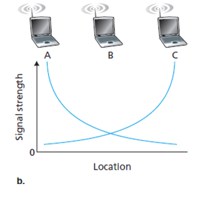

### Code Division Multiple Access (CDMA)  

- encoded signal = (original data) X (chipping sequence)
- decoding: inner-product of encoded signal and chipping sequence

- 信号中的0变为-1
- 编码器与解码器约定code，N位code对于N个通道，`sender`发送$\sum data\cdot code$，解码时用`code`和接收到的信息做内积，如果内积的结果为8，则解码为1，-8解码为-1，最后再把-1变为0（[wiki](https://zh.wikipedia.org/wiki/分碼多重進接)）

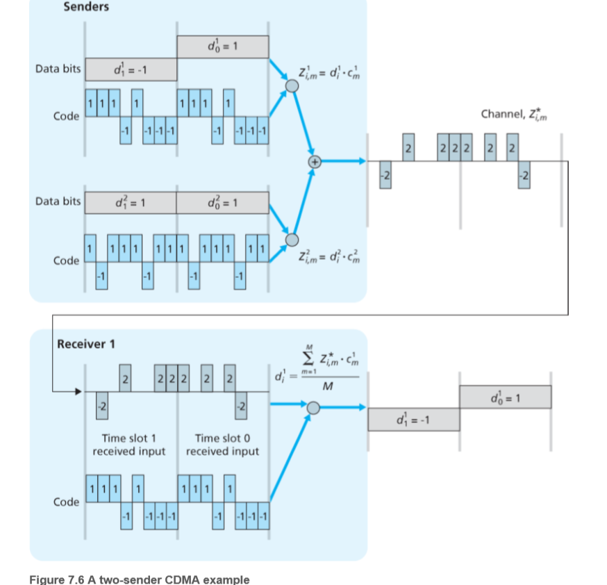

## WiFi: 802.11 Wireless LANs

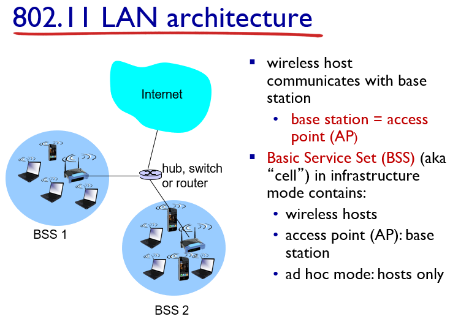

2.4G频段划分为11个信道，客户端通过`beacon frames`得知AP的SSID和MAC

两种**scanning**方式

- **Passive scanning**

AP发送`beacon frames`使得客户端可以知道连接AP的信息从而进行连接

- **active scanning**

主机发送请求包，AP对连接请求进行回应

### 利用CSMA/CA避免多路访问时的冲突

- 主机需要发送一个数据帧时，检测信道空闲达一个DIFS之后发送数据帧，主机接收完之后等待一个SIFS后发送确认帧
- 如果一段时间后没有收到确认帧，重发
- 节点准备重发时，随机设定一回退值，同时监听信道，若信道在一段时间内空闲，则计数值-1，当回退值为0时，节点重发数据

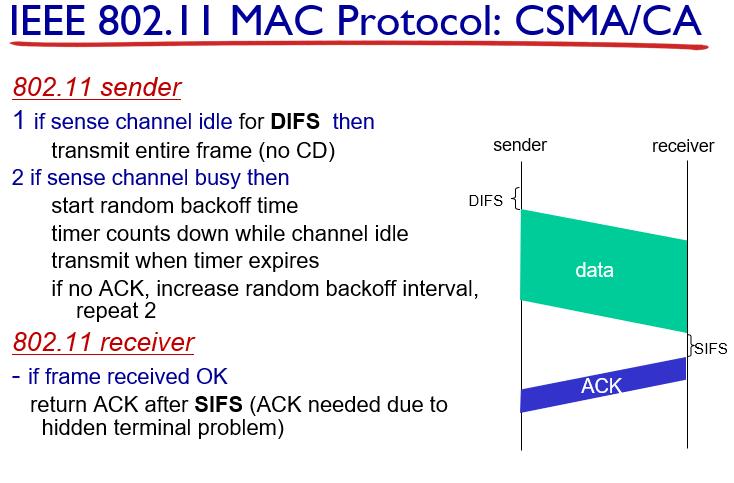

针对**Hidden terminal problem**的问题，引入**RTS/CTS**

- RTS：Request To Send
- CTS：Clear To Send

**RTS**和**CTS**都是广播帧，数据发送前主机向AP发送**RTS**，AP若能正常解析出**RTS**，会在SIFS后发送**CTS**，其他主机在接受到不属于自己的**CTS**后会悬挂起自己的回退值

当数据包过大时，由于**Hidden terminal**的问题，冲突终端都会长时间占用信道且都检测不出冲突，导致网络的崩溃，引入**RTS/CTS**后，**RTS**依然有可能发生碰撞，但采用小数据包的碰撞，避免了大数据包的碰撞

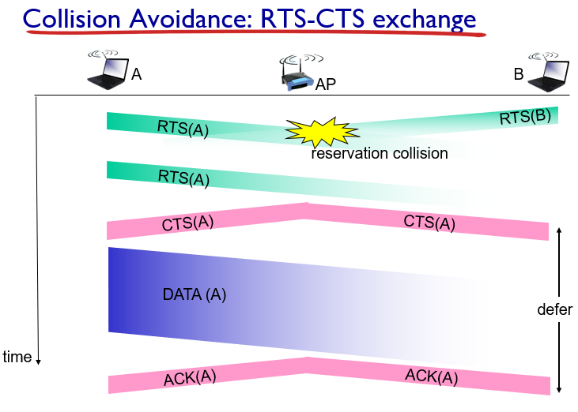

[802.11协议精读2：DCF与CSMA/CA](https://zhuanlan.zhihu.com/p/20721272)

### 802.11 Frame

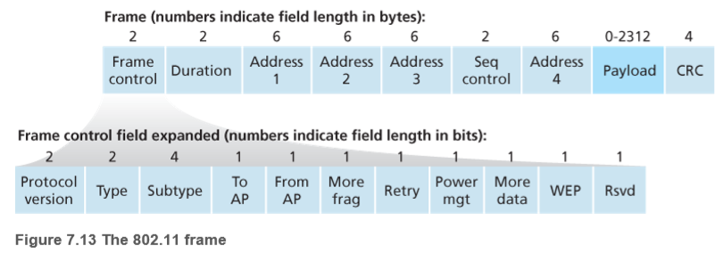

- 实际数据在Payload中
- 使用CRC校验

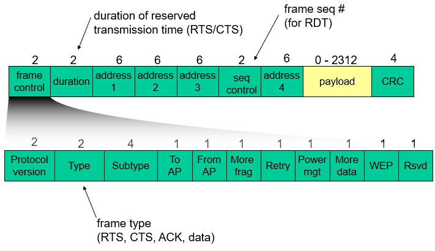

#### Address Fields

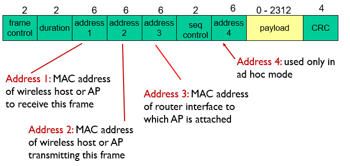

## Celluar Internet access

- 使用FDMA和TDMA
- 使用CDMA

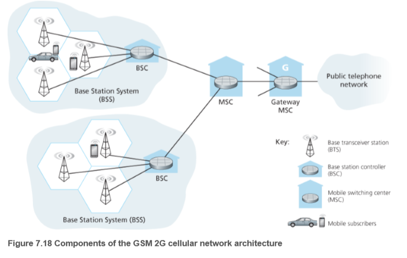

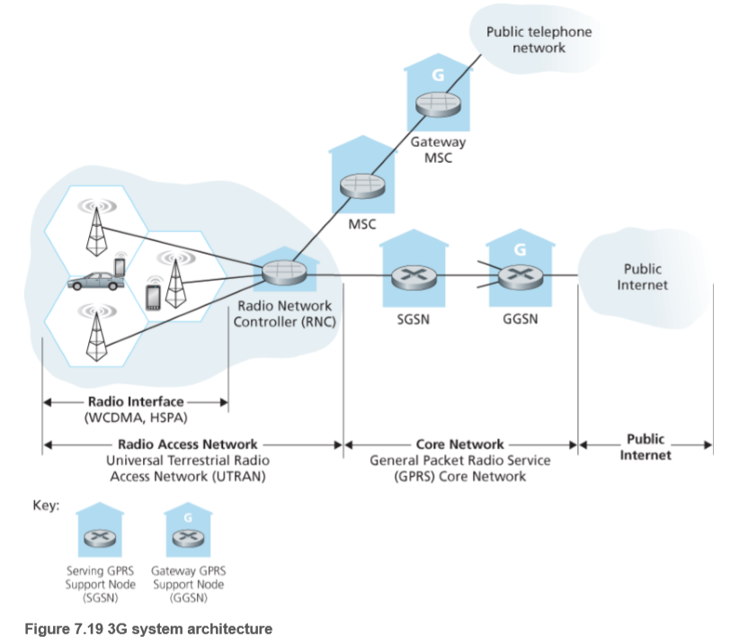

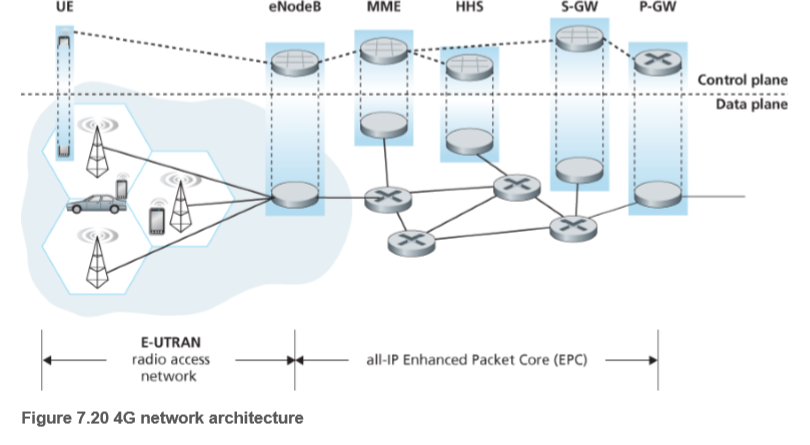

